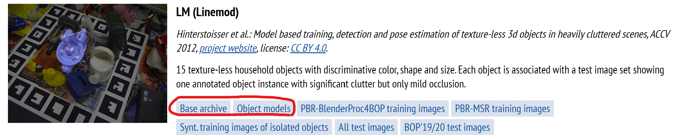
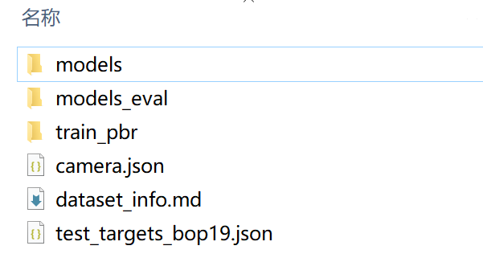

# 渲染数据集制作
## 1代码源文件准备
[mirrors\_DLR-RM/BlenderProc - ](https://gitee.com/mirrors_DLR-RM/BlenderProc?_from=gitee_search)[码云](https://gitee.com/mirrors_DLR-RM/BlenderProc?_from=gitee_search)[ - ](https://gitee.com/mirrors_DLR-RM/BlenderProc?_from=gitee_search)[开源中国](https://gitee.com/mirrors_DLR-RM/BlenderProc?_from=gitee_search)[ (gitee.com)](https://gitee.com/mirrors_DLR-RM/BlenderProc?_from=gitee_search)

[main_lm_upright](main_lm_upright.py)

上面是需要替换的文件，替换文件目录： .../BlenderProc/ examples / datasets / bop\_challenge（文件夹里已经替换完了）

[GitHub - thodan/bop\_toolkit: A Python toolkit of the BOP benchmark for 6D object pose estimation.](https://github.com/thodan/bop_toolkit) （安装bop\_toolkit）

## 2数据集准备
1、下载lm数据集的模型[BOP: Benchmark for 6D Object Pose Estimation (cvut.cz)](https://bop.felk.cvut.cz/datasets/)



2、进入BlenderProc文件夹运行`blenderproc download cc_textures`，下载场景模型（场景下载全也可以继续进行下面操作）

## 3代码运行
models\_info.json中对应的信息改成自己模型，

目录.../BlenderProc下运行`blenderproc run examples/datasets/bop_challenge/main_lm_upright.py .. resources/cctextures examples/datasets/bop_challenge/output --num_scenes=20`

..是lm数据集所在的位置

\--num\_scenes是场景循环次数，每次会将下载的背景模型遍历一遍，默认每个场景生成25张数据集

输出结果文件夹train\_pbr和camera.json

## 4整合最终数据集


输出文件整合后在bop\_toolkit中运行

```python
python scripts/calc_gt_masks.py
python scripts/calc_gt_info.py
python scripts/calc_gt_coco.py
'''
上述代码中均更改以下部分
p = {
  # See dataset_params.py for options.
  'dataset': '<bop_dataset_name>',

  # Dataset split. Options: 'train', 'val', 'test'.
  'dataset_split': 'train',

  # Dataset split type. None = default. See dataset_params.py for options.
  'dataset_split_type': 'pbr',

  # Folder containing the BOP datasets.
  'datasets_path': '<path/to/your/bop/datasets>',(datasets为lm的位置)
}
'''
```
之后运行gt.py和info.py，需要更改最后函数中对应的文件位置，用以生成gt.yml和info.yml

[gt.yml](gt.py)

[info.yml](info.py)

最后按lm数据集梳理格式即可，其中mask\_visib对应的是segnet\_results

（可以用批量修改工具对图像名称进行处理）